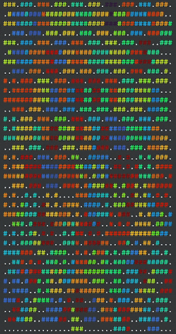
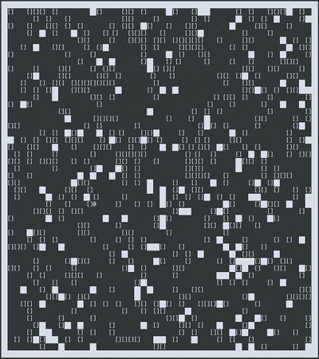
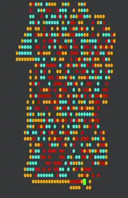
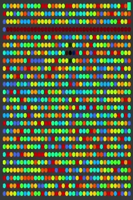
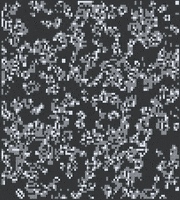

<div align="center">
	
	<br>
  <br>
</div>

> These are my solutions to the annual [Advent of Code](https://adventofcode.com)
challenge.

## Goals

🦀 *Implement everything in Rust*

👍 *Find generalized solutions that work with every input*

⛓️‍💥 *Avoid 3rd party dependencies* (if possible and reasonable). Exceptions are [rustc-hash](https://github.com/rust-lang/rustc-hash) (because it's just too fast), [rayon](https://github.com/rayon-rs/rayon) for parallelization (only in rare cases!), and any crate necessary to do occasional [terminal visualizations](#terminal-visualizations).

🏃‍♂️‍➡️ *Try to optimize performance* (to the best of my knowledge and if it doesn't
   conflict with the other goals). See [benchmarks](#benchmarks) below.

🤓 *Find clever solutions to complex problems that others might not have found.*
  Some highlights I'm particularly proud of:
* [Day 10 of 2025](2025/day10/src/main.rs): While most people approached this
  problem using a solver (such as [S3](https://github.com/Z3Prover/z3) or
  [good_lp](https://github.com/rust-or/good_lp)), I found a solution that
  works completely without a 3rd party dependency. I implemented a DFS in
  which I use heuristics to prune as many branches as possible. This is
  definitely not the fastest approach possible, but it gets the job done in
  reasonable time and is certainly quite unique. See my
  [Reddit comment](https://www.reddit.com/r/adventofcode/comments/1pity70/comment/ntb36sb/)
  for more information.
* [Day 25 of 2023](2023/day25/src/main.rs): Using
  [Brandes' algorithm](https://doi.org/10.1080/0022250X.2001.9990249) to
  quickly calculate the betweenness centrality of graph nodes.
* [Day 21 of 2023](2023/day21/src/main.rs): Applying
  [bit operations](2023/day21/src/bitarray.rs) to simulate the cellular
  automaton, which allowed me to implement a fast and generalized solution
  that should work on any input (unlike most other approaches).
* [Day 25 of 2018](2018/day25/src/main.rs): Combining DBSCAN with a spatial
  index based on Morton indices. Very fast and scalable!
* [Day 25 of 2017](2017/day25/src/main.rs): Fast Turing machine simulation using
  memoized macro transitions over fixed-size blocks inspired by tape compression
  and the [linear speedup
  theorem](https://en.wikipedia.org/wiki/Linear_speedup_theorem).

## Terminal visualizations

I've created terminal visualizations of some puzzles for fun:

<table>
  <tr>
    <td align="center">
      <a href="2025/day12/aoc_2025_day12.gif"></a><br />
      <a href="2025/day12/src/main.rs">2025 - Day 12:<br>Christmas Tree Farm</a>
    </td>
    <td align="center">
      <a href="2025/day04/aoc_2025_day04.gif"></a><br />
      <a href="2025/day04/src/main.rs">2025 - Day 4:<br>Printing Department</a>
    </td>
    <td align="center">
      <a href="2024/day15/aoc_2024_day15.gif"></a><br />
      <a href="2024/day15/src/main.rs">2024 - Day 15:<br>Warehouse Woes</a>
    </td>
  </tr>
  <tr>
    <td align="center">
      <a href="2019/day13/aoc_2019_day13.gif"></a><br />
      <a href="2019/day13/src/main.rs">2019 - Day 13:<br>Care Package</a>
    </td>
    <td align="center">
      <a href="2017/day22/aoc_2017_day22.webp"></a><br />
      <a href="2017/day22/src/main.rs">2017 - Day 22:<br>Sporifica Virus</a>
    </td>
    <td align="center">
      <a href="2016/day22/aoc_2016_day22.gif"></a><br />
      <a href="2016/day22/src/main.rs">2016 - Day 22:<br>Grid Computing</a>
    </td>
  </tr>
  <tr>
    <td align="center">
      <a href="2016/day08/aoc_2016_day08_mini.gif"></a><br />
      <a href="2016/day08/src/main.rs">2016 - Day 8:<br>Two-Factor Authentication</a>
    </td>
    <td align="center">
      <a href="2015/day18/aoc_2015_day18.gif"></a><br />
      <a href="2015/day18/src/main.rs">2015 - Day 18:<br>Like a GIF For Your Yard</a>
    </td>
  </tr>
</table>

If you want to visualize your own input with my code, just change into the
solution's directory (e.g. `cd 2025/day12`) and run the following command:

```bash
AOC_VISUALIZE=true cargo run --release
```

## Benchmarks

All measurements were performed with my [cargo bench-aoc](./cargo-bench-aoc/) tool on a MacBook Pro 16″ 2023 with an Apple M3 Pro processor. The tool uses [Divan](https://github.com/nvzqz/divan) under the hood to provide accurate and reproducible benchmark results. I/O (reading input files and printing answers to the terminal) is **NOT** included in the measurements.

### 2018

<table>
<tr>
<td><strong><a href="./2018/day01/src/main.rs">Day 1:</a></strong></td><td align="right">23µs</td>
<td><strong><a href="./2018/day02/src/main.rs">Day 2:</a></strong></td><td align="right">29µs</td>
<td><strong><a href="./2018/day03/src/main.rs">Day 3:</a></strong></td><td align="right">605µs</td>
<td><strong><a href="./2018/day04/src/main.rs">Day 4:</a></strong></td><td align="right">42µs</td>
<td><strong><a href="./2018/day05/src/main.rs">Day 5:</a></strong></td><td align="right">426µs</td>
</tr>
<tr>
<td><strong><a href="./2018/day06/src/main.rs">Day 6:</a></strong></td><td align="right">205µs</td>
<td><strong><a href="./2018/day07/src/main.rs">Day 7:</a></strong></td><td align="right">3µs</td>
<td><strong><a href="./2018/day08/src/main.rs">Day 8:</a></strong></td><td align="right">28µs</td>
<td><strong><a href="./2018/day09/src/main.rs">Day 9:</a></strong></td><td align="right">...</td>
<td><strong><a href="./2018/day10/src/main.rs">Day 10:</a></strong></td><td align="right">15µs</td>
</tr>
<tr>
<td><strong><a href="./2018/day11/src/main.rs">Day 11:</a></strong></td><td align="right">2ms</td>
<td><strong><a href="./2018/day12/src/main.rs">Day 12:</a></strong></td><td align="right">...</td>
<td><strong><a href="./2018/day13/src/main.rs">Day 13:</a></strong></td><td align="right">...</td>
<td><strong><a href="./2018/day14/src/main.rs">Day 14:</a></strong></td><td align="right">...</td>
<td><strong><a href="./2018/day15/src/main.rs">Day 15:</a></strong></td><td align="right">...</td>
</tr>
<tr>
<td><strong><a href="./2018/day16/src/main.rs">Day 16:</a></strong></td><td align="right">...</td>
<td><strong><a href="./2018/day17/src/main.rs">Day 17:</a></strong></td><td align="right">...</td>
<td><strong><a href="./2018/day18/src/main.rs">Day 18:</a></strong></td><td align="right">...</td>
<td><strong><a href="./2018/day19/src/main.rs">Day 19:</a></strong></td><td align="right">...</td>
<td><strong><a href="./2018/day20/src/main.rs">Day 20:</a></strong></td><td align="right">...</td>
</tr>
<tr>
<td><strong><a href="./2018/day21/src/main.rs">Day 21:</a></strong></td><td align="right">...</td>
<td><strong><a href="./2018/day22/src/main.rs">Day 22:</a></strong></td><td align="right">...</td>
<td><strong><a href="./2018/day23/src/main.rs">Day 23:</a></strong></td><td align="right">...</td>
<td><strong><a href="./2018/day24/src/main.rs">Day 24:</a></strong></td><td align="right">...</td>
<td><strong><a href="./2018/day25/src/main.rs">Day 25:</a></strong></td><td align="right">...</td>
</tr>
</table>

### 2017

<table>
<tr>
<td><strong><a href="./2017/day01/src/main.rs">Day 1:</a></strong></td><td align="right">2µs</td>
<td><strong><a href="./2017/day02/src/main.rs">Day 2:</a></strong></td><td align="right">3µs</td>
<td><strong><a href="./2017/day03/src/main.rs">Day 3:</a></strong></td><td align="right">749ns</td>
<td><strong><a href="./2017/day04/src/main.rs">Day 4:</a></strong></td><td align="right">196µs</td>
<td><strong><a href="./2017/day05/src/main.rs">Day 5:</a></strong></td><td align="right">43ms</td>
</tr>
<tr>
<td><strong><a href="./2017/day06/src/main.rs">Day 6:</a></strong></td><td align="right">253µs</td>
<td><strong><a href="./2017/day07/src/main.rs">Day 7:</a></strong></td><td align="right">117µs</td>
<td><strong><a href="./2017/day08/src/main.rs">Day 8:</a></strong></td><td align="right">37µs</td>
<td><strong><a href="./2017/day09/src/main.rs">Day 9:</a></strong></td><td align="right">14µs</td>
<td><strong><a href="./2017/day10/src/main.rs">Day 10:</a></strong></td><td align="right">35µs</td>
</tr>
<tr>
<td><strong><a href="./2017/day11/src/main.rs">Day 11:</a></strong></td><td align="right">37µs</td>
<td><strong><a href="./2017/day12/src/main.rs">Day 12:</a></strong></td><td align="right">146µs</td>
<td><strong><a href="./2017/day13/src/main.rs">Day 13:</a></strong></td><td align="right">5ms</td>
<td><strong><a href="./2017/day14/src/main.rs">Day 14:</a></strong></td><td align="right">2ms</td>
<td><strong><a href="./2017/day15/src/main.rs">Day 15:</a></strong></td><td align="right">205ms</td>
</tr>
<tr>
<td><strong><a href="./2017/day16/src/main.rs">Day 16:</a></strong></td><td align="right">154µs</td>
<td><strong><a href="./2017/day17/src/main.rs">Day 17:</a></strong></td><td align="right">44µs</td>
<td><strong><a href="./2017/day18/src/main.rs">Day 18:</a></strong></td><td align="right">291µs</td>
<td><strong><a href="./2017/day19/src/main.rs">Day 19:</a></strong></td><td align="right">25µs</td>
<td><strong><a href="./2017/day20/src/main.rs">Day 20:</a></strong></td><td align="right">2ms</td>
</tr>
<tr>
<td><strong><a href="./2017/day21/src/main.rs">Day 21:</a></strong></td><td align="right">5µs</td>
<td><strong><a href="./2017/day22/src/main.rs">Day 22:</a></strong></td><td align="right">41ms</td>
<td><strong><a href="./2017/day23/src/main.rs">Day 23:</a></strong></td><td align="right">80µs</td>
<td><strong><a href="./2017/day24/src/main.rs">Day 24:</a></strong></td><td align="right">3ms</td>
<td><strong><a href="./2017/day25/src/main.rs">Day 25:</a></strong></td><td align="right">2ms</td>
</tr>
</table>

### 2016

<table>
<tr>
<td><strong><a href="./2016/day01/src/main.rs">Day 1:</a></strong></td><td align="right">2µs</td>
<td><strong><a href="./2016/day02/src/main.rs">Day 2:</a></strong></td><td align="right">5µs</td>
<td><strong><a href="./2016/day03/src/main.rs">Day 3:</a></strong></td><td align="right">54µs</td>
<td><strong><a href="./2016/day04/src/main.rs">Day 4:</a></strong></td><td align="right">55µs</td>
<td><strong><a href="./2016/day05/src/main.rs">Day 5:</a></strong></td><td align="right">376ms</td>
</tr>
<tr>
<td><strong><a href="./2016/day06/src/main.rs">Day 6:</a></strong></td><td align="right">6µs</td>
<td><strong><a href="./2016/day07/src/main.rs">Day 7:</a></strong></td><td align="right">635µs</td>
<td><strong><a href="./2016/day08/src/main.rs">Day 8:</a></strong></td><td align="right">6µs</td>
<td><strong><a href="./2016/day09/src/main.rs">Day 9:</a></strong></td><td align="right">9µs</td>
<td><strong><a href="./2016/day10/src/main.rs">Day 10:</a></strong></td><td align="right">12µs</td>
</tr>
<tr>
<td><strong><a href="./2016/day11/src/main.rs">Day 11:</a></strong></td><td align="right">1ms</td>
<td><strong><a href="./2016/day12/src/main.rs">Day 12:</a></strong></td><td align="right">21ms</td>
<td><strong><a href="./2016/day13/src/main.rs">Day 13:</a></strong></td><td align="right">1µs</td>
<td><strong><a href="./2016/day14/src/main.rs">Day 14:</a></strong></td><td align="right">1.6s</td>
<td><strong><a href="./2016/day15/src/main.rs">Day 15:</a></strong></td><td align="right">1µs</td>
</tr>
<tr>
<td><strong><a href="./2016/day16/src/main.rs">Day 16:</a></strong></td><td align="right">2µs</td>
<td><strong><a href="./2016/day17/src/main.rs">Day 17:</a></strong></td><td align="right">14ms</td>
<td><strong><a href="./2016/day18/src/main.rs">Day 18:</a></strong></td><td align="right">592µs</td>
<td><strong><a href="./2016/day19/src/main.rs">Day 19:</a></strong></td><td align="right">88ns</td>
<td><strong><a href="./2016/day20/src/main.rs">Day 20:</a></strong></td><td align="right">37µs</td>
</tr>
<tr>
<td><strong><a href="./2016/day21/src/main.rs">Day 21:</a></strong></td><td align="right">7µs</td>
<td><strong><a href="./2016/day22/src/main.rs">Day 22:</a></strong></td><td align="right">3ms</td>
<td><strong><a href="./2016/day23/src/main.rs">Day 23:</a></strong></td><td align="right">1µs</td>
<td><strong><a href="./2016/day24/src/main.rs">Day 24:</a></strong></td><td align="right">137µs</td>
<td><strong><a href="./2016/day25/src/main.rs">Day 25:</a></strong></td><td align="right">26µs</td>
</tr>
</table>

### 2015

<table>
<tr>
<td><strong><a href="./2015/day01/src/main.rs">Day 1:</a></strong></td><td align="right">6µs</td>
<td><strong><a href="./2015/day02/src/main.rs">Day 2:</a></strong></td><td align="right">41µs</td>
<td><strong><a href="./2015/day03/src/main.rs">Day 3:</a></strong></td><td align="right">73µs</td>
<td><strong><a href="./2015/day04/src/main.rs">Day 4:</a></strong></td><td align="right">143ms</td>
<td><strong><a href="./2015/day05/src/main.rs">Day 5:</a></strong></td><td align="right">180µs</td>
</tr>
<tr>
<td><strong><a href="./2015/day06/src/main.rs">Day 6:</a></strong></td><td align="right">6ms</td>
<td><strong><a href="./2015/day07/src/main.rs">Day 7:</a></strong></td><td align="right">23µs</td>
<td><strong><a href="./2015/day08/src/main.rs">Day 8:</a></strong></td><td align="right">7µs</td>
<td><strong><a href="./2015/day09/src/main.rs">Day 9:</a></strong></td><td align="right">19µs</td>
<td><strong><a href="./2015/day10/src/main.rs">Day 10:</a></strong></td><td align="right">16ms</td>
</tr>
<tr>
<td><strong><a href="./2015/day11/src/main.rs">Day 11:</a></strong></td><td align="right">8ms</td>
<td><strong><a href="./2015/day12/src/main.rs">Day 12:</a></strong></td><td align="right">125µs</td>
<td><strong><a href="./2015/day13/src/main.rs">Day 13:</a></strong></td><td align="right">42µs</td>
<td><strong><a href="./2015/day14/src/main.rs">Day 14:</a></strong></td><td align="right">23µs</td>
<td><strong><a href="./2015/day15/src/main.rs">Day 15:</a></strong></td><td align="right">3ms</td>
</tr>
<tr>
<td><strong><a href="./2015/day16/src/main.rs">Day 16:</a></strong></td><td align="right">53µs</td>
<td><strong><a href="./2015/day17/src/main.rs">Day 17:</a></strong></td><td align="right">43µs</td>
<td><strong><a href="./2015/day18/src/main.rs">Day 18:</a></strong></td><td align="right">116µs</td>
<td><strong><a href="./2015/day19/src/main.rs">Day 19:</a></strong></td><td align="right">155µs</td>
<td><strong><a href="./2015/day20/src/main.rs">Day 20:</a></strong></td><td align="right">12ms</td>
</tr>
<tr>
<td><strong><a href="./2015/day21/src/main.rs">Day 21:</a></strong></td><td align="right">3µs</td>
<td><strong><a href="./2015/day22/src/main.rs">Day 22:</a></strong></td><td align="right">185µs</td>
<td><strong><a href="./2015/day23/src/main.rs">Day 23:</a></strong></td><td align="right">5µs</td>
<td><strong><a href="./2015/day24/src/main.rs">Day 24:</a></strong></td><td align="right">416µs</td>
<td><strong><a href="./2015/day25/src/main.rs">Day 25:</a></strong></td><td align="right">180ns</td>
</tr>
</table>

## License

The solutions are released under the **MIT license**. See the
[LICENSE](LICENSE) file for more information.
